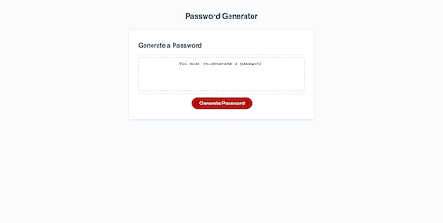

# 03-JavaScript-Password-Generator

## Description

A password is randomly generated based on criteria that the user provides when prompted.

When the user clicks the button "Generate Password" they are first promoted for password length. If outside the range of 8-50, the user will have to keep putting  numbers until its inside the length within the range. The prompt will loop until the user enters a valid number.

The program then prompts the user to define if they would like to include numbers, characters, uppercase or lowercase letters. If the user selects none to all criteria, the program will ask it to select at least each one and will loop back through the prompts. If the user does not pick at least one of the criteria, a prompt will let the use know they need to regenerate a new password. 

When all parameters have been defined, the password will appear within the password box.

## Table of Contents
* [Features](#Features)
* [Installation](#installation)
* [Usage](#usage)
* [License](#license)
* [Badges](#Badges)

## Features
- for loop
- while
- if 
- else
- return
- break

## Installation 

NO installation required you can view the page. If you want to look at my code, do a git clone or my repository. 

[Link to website]()

## Usage

## License 

MIT License
Copyright (c) 2021 Jovan Nixon
Permission is hereby granted, free of charge, to any person obtaining a copy
of this software and associated documentation files (the "Software"), to deal
in the Software without restriction, including without limitation the rights
to use, copy, modify, merge, publish, distribute, sublicense, and/or sell
copies of the Software, and to permit persons to whom the Software is
furnished to do so, subject to the following conditions:
The above copyright notice and this permission notice shall be included in all
copies or substantial portions of the Software.
THE SOFTWARE IS PROVIDED "AS IS", WITHOUT WARRANTY OF ANY KIND, EXPRESS OR
IMPLIED, INCLUDING BUT NOT LIMITED TO THE WARRANTIES OF MERCHANTABILITY,
FITNESS FOR A PARTICULAR PURPOSE AND NONINFRINGEMENT. IN NO EVENT SHALL THE
AUTHORS OR COPYRIGHT HOLDERS BE LIABLE FOR ANY CLAIM, DAMAGES OR OTHER
LIABILITY, WHETHER IN AN ACTION OF CONTRACT, TORT OR OTHERWISE, ARISING FROM,
OUT OF OR IN CONNECTION WITH THE SOFTWARE OR THE USE OR OTHER DEALINGS IN THE
SOFTWARE.

## Badges

